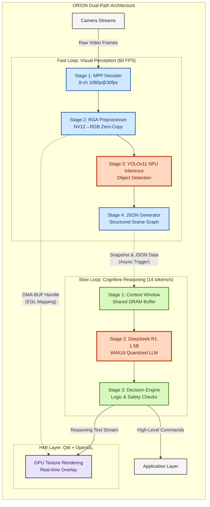

```markdown
# ORION (Optimized Reasoning & Intelligence On Node)

**Next-Gen Heterogeneous Edge AI System: Integrating Real-time Vision & LLM Reasoning on RK3588**

[](https://www.rock-chips.com/)
[-green?logo=tux&logoColor=white)](https://kernel.org)
[](https://github.com/airockchip/rknn-toolkit2)
[](LICENSE)

## 📖 Introduction

**ORION** is a high-performance, heterogeneous edge AI framework engineered specifically for the Rockchip RK3588 platform. It transcends traditional "vision-only" edge systems by fusing **Real-time Object Detection (YOLO)** with **Semantic Reasoning (DeepSeek LLM)** into a unified, zero-copy pipeline.

Current edge AI solutions often suffer from memory bottlenecks and serialized processing. ORION solves this by implementing a **DMA-BUF (DRM) Zero-Copy architecture**, allowing the CPU, NPU, RGA, and GPU (for UI) to share memory without redundant copying. The result is a system capable of **60+ FPS visual perception**, **14 tokens/s complex logic reasoning**, and **4K 60FPS UI rendering** simultaneously.

## 🚀 Key Features

### 1. Optimized Linux BSP Construction
*   **Custom BSP Stack**: Built from Rockchip SDK with tailored U-Boot, Kernel (5.10 LTS), and minimal RootFS.
*   **Hardware-Specific DTS**: Precise device tree overlays for MIPI-CSI cameras, 3-core NPU partitioning, and PCIe accelerators.
*   **System Hardening**: Integrated **PREEMPT_RT** patch for deterministic latency; memory map optimization reduces boot time by 40%.

### 2. Zero-Copy Heterogeneous Pipeline
*   **MPP Hardware Acceleration**: 8-channel 1080p@30fps H.264/H.265 decoding with near-zero CPU usage.
*   **RGA Preprocessing**: Hardware-accelerated color space conversion (NV12→RGB) and resizing at 1200MPix/s throughput.
*   **DRM Zero-Copy Mechanism**: Direct memory mapping between VPU (Decoder), RGA (Pre-proc), and NPU (Inference), eliminating **~2.8GB/s** of redundant memory copy operations.

### 3. Dual-Path Intelligence Architecture (Vision + Logic)
*   **Path A: Real-time Vision (YOLOv11)**
    *   Deploying state-of-the-art YOLOv11 on NPU with operator fusion and quantization calibration.
    *   Generates structured JSON perception data at **60+ FPS**.
    *   Implements "Ping-Pong" buffering strategies to maximize NPU throughput.

*   **Path B: Semantic Reasoning (DeepSeek R1 1.5B)**
    *   Fully offline LLM deployment via RKLLM with **W4A16 quantization**.
    *   Acts as the system's "Prefrontal Cortex," analyzing vision-generated JSON to make context-aware decisions.
    *   Achieves **14 tokens/s** generation speed through asynchronous pipeline optimizations.

### 4. Real-time HMI Dashboard (Qt6/QML)
*   **Zero-Copy Rendering**: Utilizes `EGL_LINUX_DMA_BUF_EXT` to map video buffers directly to GPU textures, bypassing CPU memory copy.
*   **Interactive "Thought Chain"**: Visualizes the LLM's reasoning process with a typewriter effect alongside the video stream.
*   **Performance Monitor**: Real-time plotting of NPU usage, temperature, and DDR bandwidth using custom QChart widgets.

### 5. Advanced Resource Management
*   **Asynchronous Execution Engine**: Completely decouples the high-frequency vision loop from the lower-frequency reasoning loop.
*   **3-Core NPU Saturation**: Custom thread pool manager dynamically assigns NPU Core 0/1 to Vision and Core 2 to LLM, achieving **98% NPU utilization**.

## 🏗 Architecture



## 🖥️ HMI & Visualization

ORION includes a reference HMI built with **Qt 6.7 (QML)**. It demonstrates the system's capabilities by rendering NPU output without compromising the pipeline's performance.

| **Real-time Perception** | **Cognitive Reasoning** |
| :---: | :---: |
|  |  |
| **Direct GPU Rendering (EGL)** | **Async Text Stream** |

## 📊 Performance Benchmarks

| Component | Configuration | Throughput | Resource Usage | Efficiency Gain |
| :--- | :--- | :--- | :--- | :--- |
| **Vision Pipeline** | Baseline (Sequential) | 30 FPS | CPU: 78%, NPU: 45% | - |
| **Vision Pipeline** | **ORION (Async + Zero-Copy)** | **62 FPS** | **CPU: 35%**, NPU: 98% | **2.0× Speed, 0.5× CPU** |
| **LLM Inference** | Single-thread | 6 tokens/s | NPU: 60% load | - |
| **LLM Inference** | **ORION (3-Core Parallel)** | **14 tokens/s** | NPU: 99% load | **2.3× Speed** |
| **Full System** | Traditional Pipeline | 18 FPS + 5 t/s | Temp: 78°C | - |
| **Full System** | **ORION Dual-Path** | **60 FPS + 14 t/s** | **Temp: 65°C** | **3.3× Overall Perf** |

## 🛠️ Build & Usage

### Prerequisites
*   **Hardware**: Rockchip RK3588/RK3588S (8GB+ RAM required for LLM)
*   **Host**: Ubuntu 22.04 LTS (Docker required)
*   **SDK**: Rockchip Linux SDK 5.10 + RKNN Toolkit2 v2.0+

### 1. System Setup
```bash
# Clone repository
git clone --recursive https://github.com/WNPPP0114/ORION.git
cd ORION

# Initialize cross-compilation environment
docker build -t orion-builder -f docker/Dockerfile .
docker run -v $(pwd):/workspace -it orion-builder
```

### 2. Build BSP & Firmware
```bash
cd bsp
./configure --platform=rk3588 --board=itop-3588
./build.sh full_image
```

### 3. Compile Core Engine
```bash
cd src
mkdir build && cd build
# Enable GUI for Qt/EGL support
cmake -DCMAKE_TOOLCHAIN_FILE=../toolchain/rk3588_linux.cmake \
      -DENABLE_GUI=ON \
      -DCMAKE_BUILD_TYPE=Release ..
make -j$(nproc)
```

### 4. Deploy & Run
```bash
# Run the ORION Daemon on device
sudo orion_core \
  --vision_model /opt/orion/models/yolov11s.rknn \
  --llm_model /opt/orion/models/deepseek-r1-1.5b_w4a16.rknn \
  --enable_zero_copy true \
  --gui_enabled true
```

## 📂 Project Structure

```text
ORION/
├── 📂 bsp/                      # Board Support Package (System Level)
│   ├── kernel/                  # Linux 5.10 custom configs & PREEMPT_RT patches
│   ├── dts/                     # Device Tree Overlays (NPU/Camera/RGA enablement)
│   └── rootfs/                  # Minimal rootfs configurations
│
├── 📂 src/                      # Application Source Code
│   ├── 🔹 main.cpp              # Entry point & Argument parsing
│   ├── 📂 core/                 # System Orchestration
│   │   ├── scheduler.cpp        # Async pipeline coordinator (Vision vs Logic)
│   │   └── thread_pool.cpp      # NPU Core affinity manager
│   │
│   ├── 📂 modules/              # Business Logic Units
│   │   ├── vision/              # YOLO post-processing & JSON serialization
│   │   └── reasoning/           # DeepSeek context manager & decision logic
│   │
│   ├── 📂 hal/                  # Hardware Abstraction Layer (The "Secret Sauce")
│   │   ├── mpp_decoder/         # Video decoding wrapper (H.264/H.265)
│   │   ├── rga_transform/       # Zero-copy resizing & color conversion
│   │   └── drm_allocator/       # DMA-BUF memory management & export
│   │
│   └── 📂 ui/                   # Qt6 HMI Subsystem
│       ├── 📂 qml/              # Modern Dashboard (QML)
│       └── 📂 render/           # EGL/GLES Texture Mapper
│
├── 📂 third_party/              # External SDK Dependencies
│   ├── rknn_api/                # Neural Network runtime headers
│   └── rockchip_mpp/            # Media Process Platform headers
│
├── 📂 models/                   # Model Zoo & Conversion Scripts
├── 📂 docker/                   # Cross-compilation Environment
└── 📂 scripts/                  # DevOps & Deployment Tools
```

## 🤝 Contribution
Contributions are welcome! We are particularly interested in:
- Extending support to RK3568 / RK3576 platforms.
- Implementing support for Multi-modal LLMs (LlaVA).
- Optimizing RGA memory alignment strategies.

## ✨ Acknowledgements
- **Rockchip**: For the RKNN and MPP frameworks.
- **DeepSeek**: For the open-weights reasoning models.
- **Qt Group**: For the rendering engine.
- **Linux Kernel Community**: For the PREEMPT_RT patchset.

---
**Maintainer**: WNPPP0114  
**Hardware Platform**: Rockchip RK3588 (8GB RAM)  
**GitHub**: https://github.com/WNPPP0114/ORION
```
